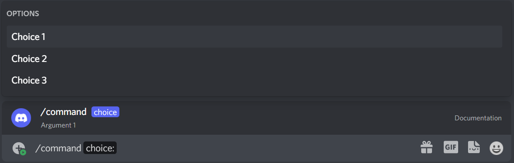

.. currentmodule:: discord

.. _app_commands:

Commands
==============

Application commands are used to create slash commands and context menu commands.

Commands are defined by attaching the :attr:`Client.application_command` decorator on a class which inherits
from either :class:`.SlashCommand`, :class:`.UserCommand` or :class:`.MessageCommand`.

For example, to create a slash command:

.. code-block:: python3

    @client.application_command
    class MyFooCommand(app.SlashCommand, name="foo", description="Foo command"):

        arg: str

        async def callback(self):
            await self.interaction.response.send_message(self.arg)

There are two ways of registering a command. The first one is by using :meth:`.Client.application_command` decorator,
as seen in the example above. The second is by calling the :meth:`Client.application_command` on the instance.

Like so:

.. code-block:: python3

    class MyFooCommand(app.SlashCommand, name="foo", description="Foo command"):

        arg: str

        async def callback(self):
            await self.interaction.response.send_message(self.arg)

    client.application_command(MyFooCommand)

Command Metadata
-----------------

Command metadata is declared when defining the class. The following attributes are available:

• **name** (Optional[:class:`str`]) — The name of the command. If not provided, the name of the class will be used.

• **description** (Optional[:class:`str`]) — The description of the command. A docstring can also be used to define the description. Context menu commands do not support descriptions.

• **guilds** (Optional[List[:class:`int`]]) — A list of guild IDs that the command can be used in. If not provided, command will be registered globally.

• **parent** (Optional[:class:`discord.app.Command`]) — The parent command. If not provided, command will be registered as a top-level command.

Arguments
----------

Creating arguments is done by creating class variables.
An argument's description can be set via :class:`app.Option`. If no description is provided, "No description" will be default.

For example:

.. code-block:: python3

    class MyFooCommand(app.SlashCommand, name="foo", description="Foo command"):

        arg1: str = app.Option(description="Argument 1")

        async def callback(self):
            await self.interaction.response.send_message(self.arg)

The current types that are supported are:

 +------------------+-------------------------------------------------------+
 | Discord Type     |                     Python Type                       |
 +==================+=======================================================+
 | 3 - String       | :class:`str`                                          |
 +------------------+-------------------------------------------------------+
 | 4 - Integer      | :class:`int`                                          |
 +------------------+-------------------------------------------------------+
 | 5 - Boolean      | :class:`bool`                                         |
 +------------------+-------------------------------------------------------+
 | 6 - User         | :class:`discord.Member` or :class:`discord.User`      |
 +------------------+-------------------------------------------------------+
 | 7 - Channel      | :class:`discord.PartialSlashChannel`                  |
 +------------------+-------------------------------------------------------+
 | 8 - Role         | :class:`discord.Role`                                 |
 +------------------+-------------------------------------------------------+
 | 9 - Mentionable  | Why no support?                                       |
 +------------------+-------------------------------------------------------+
 | 10 - Number      | :class:`float`                                        |
 +------------------+-------------------------------------------------------+

.. note::

    1. The integer and number types range between -2^53 and 2^53. This makes them unsuitable for ids. Use a string instead.
    2. The channel type will show all channels, including categories. Channel types are supported in ext.commands,
       but not in this for some weird reason lol 
    3. The mentionable type is not supported.

Autocomplete
+++++++++++++

You can make an argument autocomplete by passing `autocomplete` as True in :class:`app.Option`.
Autocomplete is only supported for strings, ints and floats. Maximum options in autocomplete is 25.

When the user focuses the argument, discord starts sending the input that the user types including any 
other options they have filled upto that point. The :meth:`.SlashCommand.autocomplete` is fired to handle this request. 

.. code-block:: python3

    class AutoCompleteExample(app.SlashCommand, name="autocomplete", description="Example command for autocomplete"):

        arg1: str = app.Option(description="Argument 1", autocomplete=True)

        async def autocomplete(self):

            result = discord.app.AutoCompleteResponse()
            choices = ["a", "b", "c"] # Load stuff to suggest to user
            for name in choices:
                result.add_option(name=name, value=name)
            return result

        async def callback(self):
            await self.interaction.response.send_message(self.arg)

Optional 
+++++++++

To make an argument optional, wrap the type of the argument with :class:`typing.Optional`.

.. code-block:: python3

    class MyCommand(app.SlashCommand, name="command", description="My awesome command"):

        arg1: str = app.Option(description="Argument 1")
        arg2: typing.Optional[str] = app.Option(description="Argument 2", default="The default value")

        async def callback(self):
            await self.interaction.response.send_message(f"{self.arg1=}\n{self.arg2=}")

Choices
++++++++

You can make predefined choices for an argument by providing the type as :class:`typing.Literal`. They look like this:

choices only support strings, ints and floats.

.. code-block:: python3

    class MyCommand(app.SlashCommand, name="command", description="My awesome command"):

            choice: typing.Literal["Choice 1", "Choice 2", "Choice 3"] = app.Option(description="Argument 1")
        
            async def callback(self):
                await self.interaction.response.send_message(f"Choice is {self.choice}")
